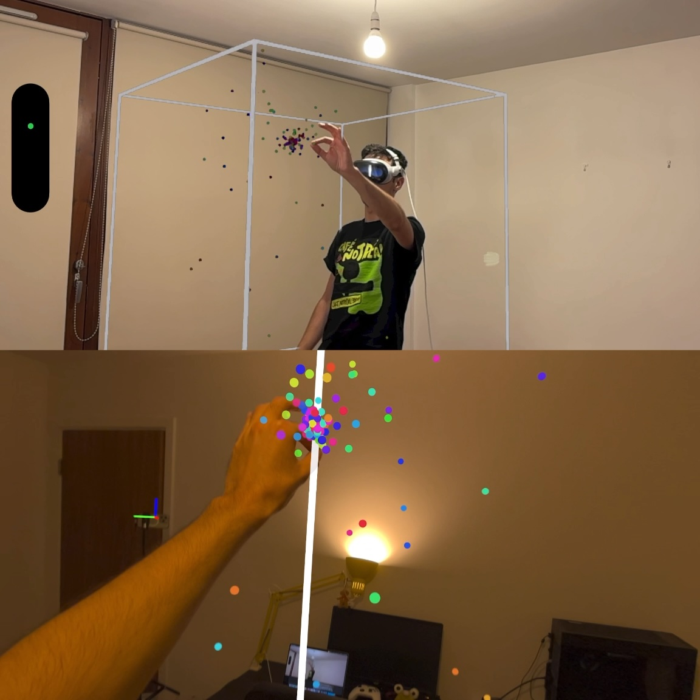
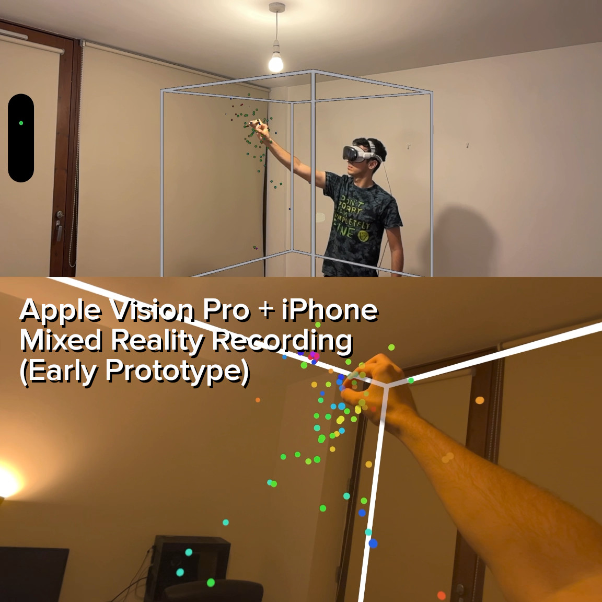

# Reality Mixer Pro <br/> *Mixed Reality Capture app for the Vision Pro*

Reality Mixer lets you use your iPhone or iPad to display and record Vision Pro apps in Mixed Reality.

In other words, you can use your iPhone or iPad as a spectator camera.

This app is similar to the [Reality Mixer app](http://github.com/fabio914/RealityMixer) (compatible with the Meta Quest 2/3/Pro) and the [Reality Mixer JS](http://github.com/fabio914/reality-mixer-js/) (compatible with Three.js and WebXR) apps.

Click on the images below to watch the video:

<a href="https://www.youtube.com/watch?v=KzSbWwRCRrg"></a>

<a href="https://www.youtube.com/watch?v=tPH5eTK-bGM"></a>

Follow us on [Twitter](https://twitter.com/reality_mixer) for more updates!

## Attention

This is still a very early prototype. 

## What's inside?

This repository contains:
 - A Swift Package (`RealityMixerVisionPro` with the `MixedRealityCapture` library for visionOS).
 - A visionOS demo project (inside `VisionProProject`) that uses the `MixedRealityCapture` library.
 - An iOS app (inside `iPhoneProject`) that can connect to visionOS apps that use the `MixedRealityCapture` library, and that can receive, decode, and display the Mixed Reality video.

## How to use it?

Requirements: 
 - iPhone that supports Person Segmentation with Depth running iOS 18.
 - Vision Pro running visionOS 2.
 - Xcode 16.0.

1. Build and install the iOS (inside `iPhoneProject`) and visionOS (inside `VisionProProject`) apps with Xcode 16 (or newer). 

2. First run the visionOS app, then launch the iOS app and type the local IP address of your Vision Pro (assuming that both the iPhone and the Vision Pro are connected to the same local network) and then tap on "Connect".

3. Look at the image displayed on the iPhone screen with the Vision Pro so the Vision Pro can detect the position and orientation of the camera. After that, tap on the "Calibration image" button to hide this image.

4. Interact with the demo app with the Vision Pro. The app on the iPhone should now display the Mixed Reality video.

## How to add support to your visionOS app?

This library is only compatible with visionOS apps that use RealityKit in an `ImmersiveSpace`. 

1. Add this dependency to your project using Swift Package manager.

2. `import MixedRealityCapture` and keep a single instance of `MixedRealityCaptureManager` (`let mrcManager: MixedRealityCaptureManager`) in your "view model"/"app model".

3. Instantiate an Image Tracking Provider with `let imageTracking = MixedRealityImageTracking.imageTrackingProvider()` and use it to update the position and orientation of the external camera (`mrcManager.updateCameraPosition(with: update.anchor)`).

4. Instantiate a World Tracking Provider (necessary so we can detect the position and orientation of the Vision Pro).

5. Set the `referenceEntity` in the `MixedRealityCaptureManager` instance. All the child entities will be rendered as part of the Mixed Reality video.

Here's a basic example with a unlit green sphere:

```swift
import SwiftUI
import RealityKit
import ARKit
import OSLog

import MixedRealityCapture

@main
struct BasicApp: App {
    @State private var model = AppModel()
    @Environment(\.dismissImmersiveSpace) var dismissImmersiveSpace
    @Environment(\.openWindow) var openWindow

    var body: some SwiftUI.Scene {
        ImmersiveSpace {
            RealityView { content in
                content.add(model.setupContentEntity())
            }
            .task {
                do {
                    if model.dataProvidersAreSupported && model.isReadyToRun {
                        try await model.session.run([model.imageTracking, model.worldTracking])
                    } else {
                        await dismissImmersiveSpace()
                    }
                } catch {
                    logger.error("Failed to start session: \(error)")
                    await dismissImmersiveSpace()
                    openWindow(id: "error")
                }
            }
            .task {
                await model.processImageTrackingUpdates()
            }
            .task {
                await model.monitorSessionEvents()
            }
            .onChange(of: model.hasError) {
                openWindow(id: "error")
            }
        }
        .persistentSystemOverlays(.hidden)

        WindowGroup(id: "error") {
            Text("An error occurred; check the app's logs for details.")
        }
    }

    init() {
    }
}

@MainActor
let logger = Logger(subsystem: "BasicApp", category: "general")

@Observable
@MainActor
final class AppModel {
    let session = ARKitSession()
    let worldTracking = WorldTrackingProvider()
    let imageTracking = MixedRealityImageTracking.imageTrackingProvider()

    private let mrcManager: MixedRealityCaptureManager

    private(set) var contentEntity = Entity()

    var hasError = false

    var dataProvidersAreSupported: Bool {
        WorldTrackingProvider.isSupported && ImageTrackingProvider.isSupported
    }

    var isReadyToRun: Bool {
        worldTracking.state == .initialized && imageTracking.state == .initialized
    }

    init() {
        // Instantiate the Mixed Reality Capture manager
        self.mrcManager = MixedRealityCaptureManager()
        mrcManager.delegate = self
    }

    func setupContentEntity() -> Entity {

        // We're using `UnlitMaterial` here so we don't need to pass
        // an Entity with Light to the Mixed Reality video
        let sphere = ModelEntity(mesh: .generateSphere(radius: 1.0), materials: [UnlitMaterial(color: .green)])
        sphere.position = [0, 1.5, -2]

        // Adding this sphere to the entity that will be rendered in the
        // Mixed Reality Video
        let mixedRealityEntities = Entity()
        mixedRealityEntities.addChild(sphere)
        mrcManager.referenceEntity = mixedRealityEntities

        // Adding these entities to our scene too
        contentEntity.addChild(mixedRealityEntities)
        return contentEntity
    }

    func processImageTrackingUpdates() async {
        for await update in imageTracking.anchorUpdates {

            // Update the camera position and orientation when we
            // detect the calibration image
            mrcManager.updateCameraPosition(with: update.anchor)
        }
    }

    func monitorSessionEvents() async {
        for await event in session.events {
            switch event {
            case .authorizationChanged(type: _, status: let status):
                logger.info("Authorization changed to: \(status)")

                if status == .denied {
                    hasError = true
                }
            case .dataProviderStateChanged(dataProviders: let providers, newState: let state, error: let error):
                logger.info("Data provider changed: \(providers), \(state)")
                if let error {
                    logger.error("Data provider reached an error state: \(error)")
                    hasError = true
                }
            @unknown default:
                fatalError("Unhandled new event type \(event)")
            }
        }
    }
}

extension AppModel: MixedRealityCaptureDelegate {

    func didUpdateCamera(pose: Pose) {
        // Optional: Update some entity in your scene that
        // represents the position of the external camera
    }
}
```

## Credits

Developed by [Fabio Dela Antonio](http://github.com/fabio914).

This project uses [SwiftSocket](https://github.com/swiftsocket/SwiftSocket) to handle the TCP connection with the Vision Pro, Apple's VideoToolbox to encode and decode the video stream, and ARKit and RealktyKit. Its video decoder is based on [zerdzhong's SwiftH264Demo](https://github.com/zerdzhong/SwfitH264Demo).

Special thanks to [Yasuhito Nagatomo](https://twitter.com/AtarayoSD) for sharing the `RealityRenderer` example on Twitter.
